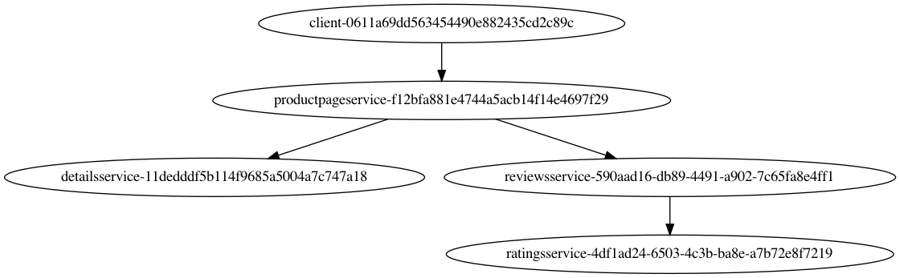

# ldfi-interpreter
LDFI Integration with 3MileBeach

## Requirements
```
    python >= 3.9 (Although might work with older version, but not tested)
```

## Repo Structure
```
.
├── LICENSE
├── README.md
├── client
│   └── client.py
├── graphs
├── ldfi_interpreter
│   ├── __main__.py
│   └── json_format.py
├── requests
│   └── request-0.json
├── requirements.txt
└── traces
    └── trace-0.json
```
## Installation
#### 1.
In order to get `graphviz` to work on my Mac, I needed to install `graphviz` via Homebrew like so:
```
    brew install graphviz

    OR
    You need to make sure the Graphviz executables are on your systems' PATH
```

#### 2.
Setup a virtual env (Optional)
```
    cd ldfi-interpreter
    virtualenv --system-site-packages -p python3 ./venv
    source ./venv/bin/activate
```

#### 3.
Install `requirements.txt`
```
    cd ldfi-interpreter
    source ./venv/bin/activate
    pip install -r requirements.txt
```

# Documentation
### `ldfi-interpreter/requests`
This directory is used in order to make 3MileBeach request to the BookInfo application. Bookinfo with 3MileBeach needs to be running in order for request to go through. Request files need to be in JSON format, that follow thre `request` data structure below. An example is located in the directory named `request-0.json`. It's contents can be viewed below.
```
{
    "requests":[
        {
            "cookie_url": "127.0.0.1:8090",
            "trace": "",
            "requests": [
                {
                    "method": "GET",
                    "URL": "/productpage",
                    "url_values":"",
                    "message_name": "Product Page",
                    "trace": "",
                    "expect": ""
                }
            ]
        }
    ]
}
```


### `ldfi-interpreter/traces`
Assuming that the BookInfo application is running, supports 3MileBeach, and the request go through, then the trace information will be added to this directory. For example. If we execute the `requests/request-0.json` request, the corresponding trace information will be located at `traces/trace-0.json`. For example purposes file `traces/trace-0.json` is located in the repository.


### `ldfi-interpreter/graphs`
Each trace in the `traces` will be examined, and will be used to generate a DAG that corresponds to the given trace. For example. if we have trace information `traces/trace-0.json`, then there will be a corresponding DAG graph `graphs/graph-0.jv`. For example purposes files `graphs/graph-0.gv` and `graphs/graph-0.gv.png` are located in the repository.



# 3MileBeach Tracing and Fault Injection

## Client Request
```
    Request Data Strcture


    HTTPMethod:             int64
        HTTPGet             1
        HTTPPost            2


    ActionResponse:         int64
        PrintResponse:      1
        DeserializeTrace:   2
        CustomizedRspFunc:  3


    ExpectedResponse:       int64
        ContentType:        string
        Action:             ActionResponse


    Request:
        Method:             HTTPMethod
        URL:                string
        UrlValues:          url.Values // HTTP Post

        MessageName:        string
        Trace:              Trace
        Expect              ExpectResponse


    Requests:
        CookieUrl:          string
        Trace:              Trace

        Requests:           []Request

```
### Trace Data Structure
```
    Trace:
        Id:                 int64
        Records:            []*Records
        Tfis:               []*Tfis
```
### Record Data Structure
```
    MessageType:            int32
        Message_Request:    1
        Message_Response:   2

    RecordType              int32
        RecordSend:         1
        RecordReceive:      2

    Records
        Type:               RecordType
        Timestamp:          int64
        MessageName:        string
        Uuid:               string
        Service:            string
```
### Timed Fault Injection Data Structure
```
    FaultType:              int32
        FaultCrash:         1
        FaultDelay:         2

    TFIMeta:
        Name:               string
        Times:              int64
        Already:            int64

    TFI:
        Type:               FaultType
        Name:               []string
        Delay:              int64
        After:              []*TFIMeta
```